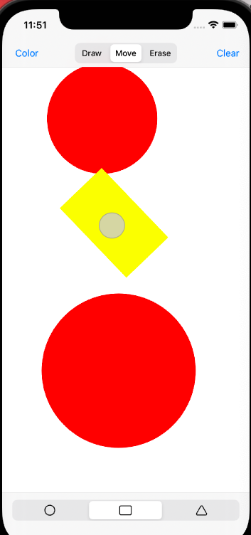

Lab 3

Yichao Wang

Contacts: w.yichao@wustl.edu or https://github.com/StevenWongChess

Here is my idea for Creative portion and Bonus.

To adjust colour, you can click the color button on top-left corner, I have an array of colors to iterate. In my daily usage of drawing apps. Six colors is far from enough and the freedom to choose color is key to drawing. To increase user's experience, the better way is to use a color selector (from dropdown list) or let the user to input the rgb value by clicking the color circle (just like what we do in Adobe Photoshop). I really would love to implement this feature, but there is a strange bug that takes me countless days and remain unsolved. There are limited space for me to put my buttons ( the root cause of the bug is that the size of drawview becomes large enough to consume the whole screen and the buttons on the view are missing though I can see the buttons in the storyboard preview). I think the whole implementation worth 10 points but I have no space to put buttons. 

The idea to adjust the opacity is by introducing a slider in the view to change the value of opacity and use **IBAction** to change the global variable opacity. We also introduce a variable opacity so that we can initialize the shapes using it. After that, when we do . 

For first extra credit, creating the hollow and solid shape. The purpose of this exercise is to pracitice OOP design. However, since I have already using subclass of shape to be Circle, Rectangle and Triangle. If i continue to create subclass of shape as hollow_shape and solid_shape, it will lead to diamond problem in OOP design, which will lead to BIG TROUBLE like in C++. And creating subclass of three shapes as 6 subclasses e.g. hollow_circle is a bad design. To make life easier, we can achieve this by overwriting the ```draw ``` method so that the ```color.setfill()``` is replaced by ```UIColor.clear.setfill()``` . A better way is to add a variable, see line 20 in ```Shape.swift ``` and change line 121 of ```Shape.swift``` into ```self.solid_color.setFill()```. 

For screenshot 10 points, again, no space to place button so share the trigger with color change, hoping that this bug does not lead to heavy or multiple duductions. See the print message on the console, screenshot is made. Reference: https://www.youtube.com/watch?v=RRjG2n60hNU 

We only need three steps. First add an extension function to UIView so that we can get the screenshot ( simply by using UIGraohicsImageRenderer) Then we add the access permission in ```info.plist``` Finally we call the ```UIImageWriteToSavedPhotosAlbum``` function and everthing is done. 