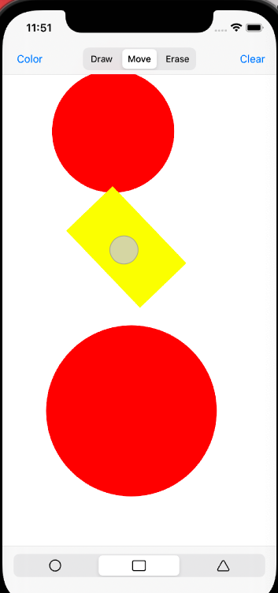

# IOS/Swift

There are **four projects** and one Swift tutorial.

You can find my Swift learning notes in `Notes.md`

###### 1. DrawingApp

Demo: 

​	Features: Use **UIKit** and **Core Graphics** to create the drawing app. Additionally, it requires me to **work with existing code**, using **object-oriented** concepts to complete the functionality. The user should be able to draw shapes with different colors, move them, resize them, and rotate them. Additionally, they should be able to erase a shape and to clear all shapes on the screen. Shapes should always update live as the user move their finger, and they should update appropriately.

###### 2. MovieSearchApp

​	Features: allows users to find information about movies. **JSON** data will be pulled from The Movie Database’s (TMDb) **API** (http:// www.themoviedb.org). Users should be able to search for movies, see the results populated in a **collection view**, and select a movie to view more details. They should also be able to favorite a movie, and view all of their saved favorites on a different tab.

###### 3. ShoppingCalculator

​	Features: calculates the final price of a product based on its original price, the current discount percentage, and the local sales tax. The calculator should be **easy to use**. Everything should appear on the same screen, with labels and text fields that the user can edit. Whenever one of the fields is changed, the final price of the product should be updated.

###### 4. VirtualPetApp

​	Features: allows users to play with their virtual pets. There should be only one screen, the layout works on a variety of device sizes and orientations (not just an iPhone 12 Pro in portrait) using **auto layout** and **MVC** programming paradigm.
