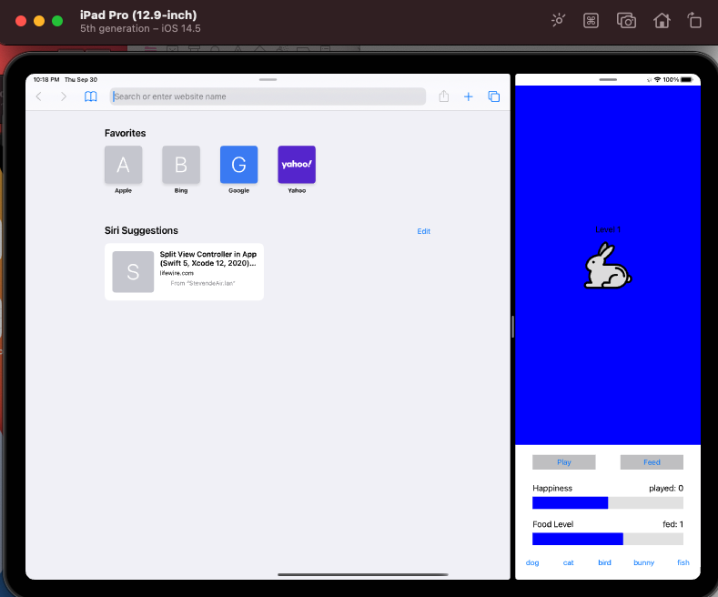
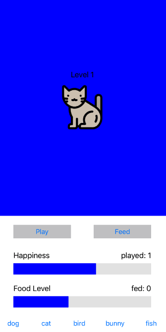
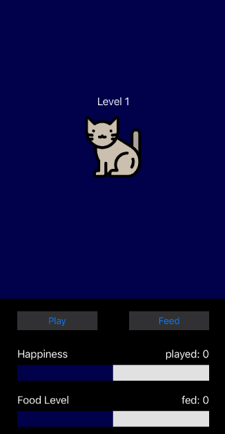

Lab 1

Yichao Wang

Contacts: w.yichao@wustl.edu or https://github.com/StevenWongChess

Here is my idea for Creative portion, I designed the level up system.

The basic logic is that the we have the initial value of happiness and food level as 5. Once they both increase to the maximum value, the pet will level up and the maximum value will be increased by 5. After evolving to level 3, we are in the final mega shape. No further evolving is available anymore. 

Once level up, there will be a label popping up on the screen showing ```level up```. This is achieved by introducing a string variable and we refresh the values to the front-end every time we touch a button. 

Another function is to play music when we feed the pet. This is done by introducing the AVFoundation  library.

I downloaded the sound files from this [website](https://www.fesliyanstudios.com/royalty-free-sound-effects-download/chewing-food-158).




For the extra point:

To enable the dark mode, we need to go to the developer in the settings and click dark appearance. We add a if clause in the refresh function to change the brightness of the color.

Pls see the screenshot comparison below




